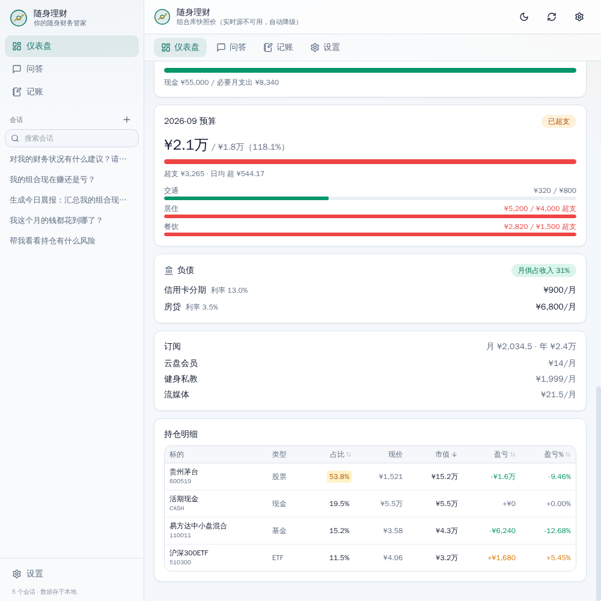
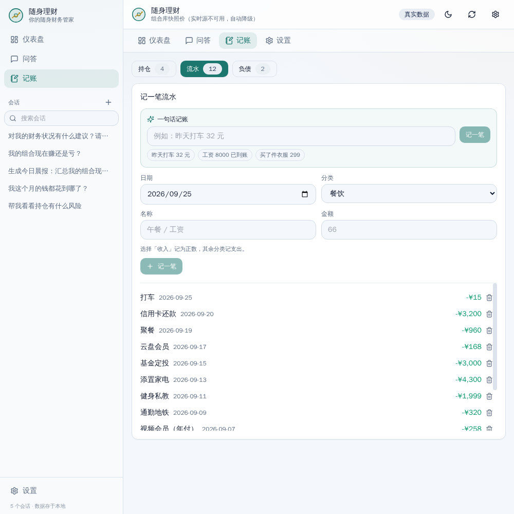
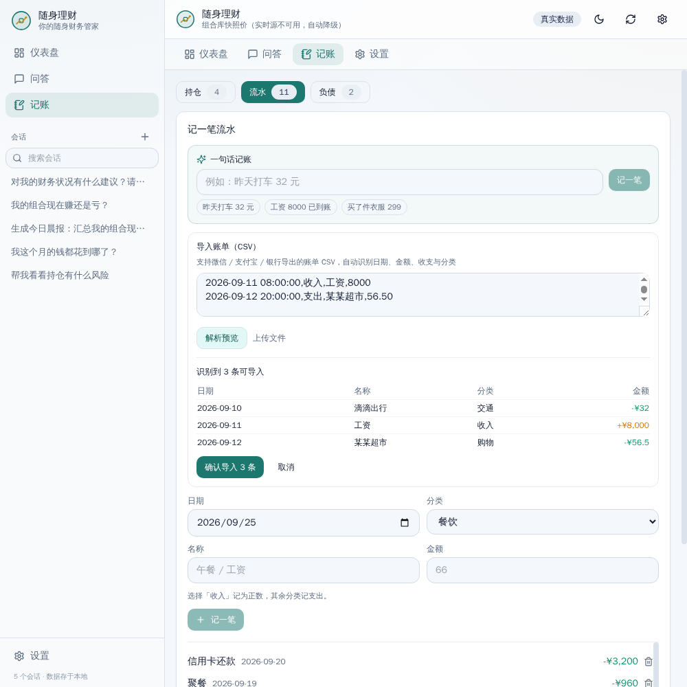
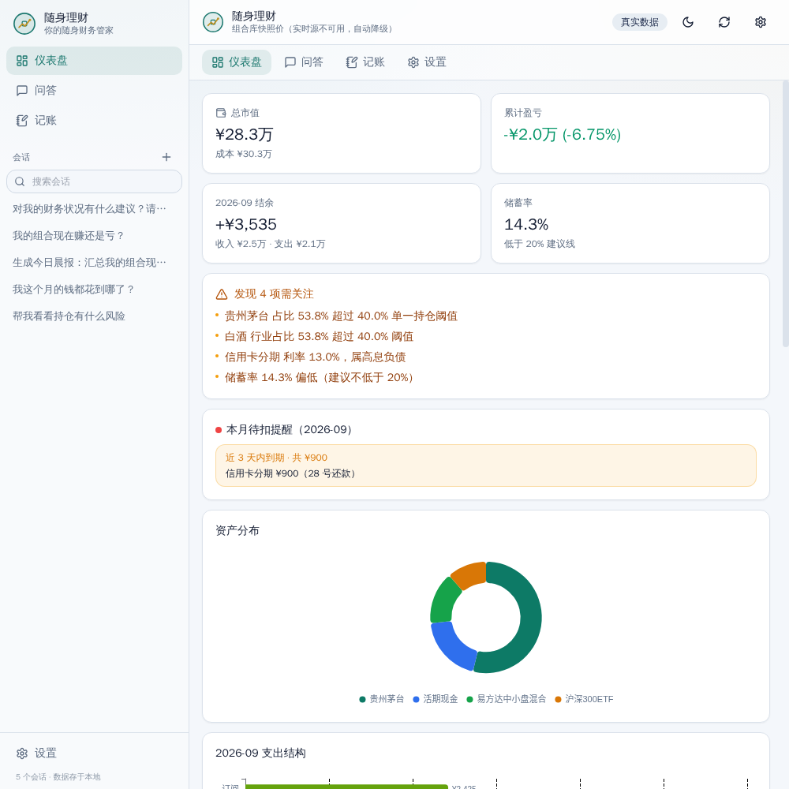
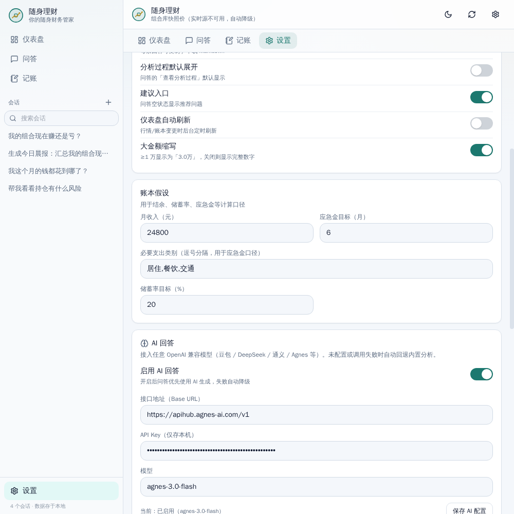
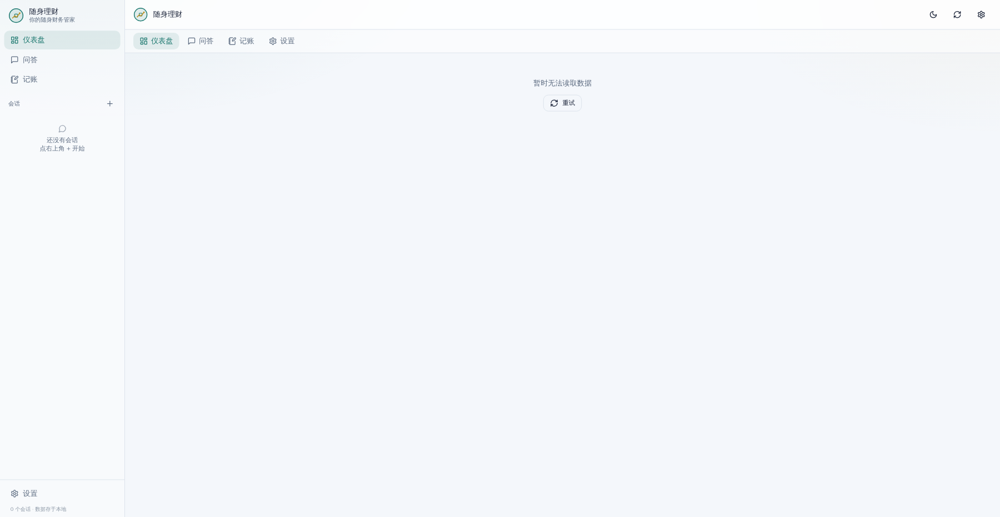

# 随身理财 · 你的随身财务管家

一个**以仪表盘为中心**的个人财务工作台：本地账本 + 组合持仓 + 风控规则引擎 + 可选大模型问答 + PWA 移动端。
数据全部存在本地 SQLite，行情走东方财富（失败自动降级快照），模型走国内 OpenAI 兼容端点，不依赖国外服务。

> 设计原则：**确定性内核优先**（数字全部由规则引擎计算，可靠免费秒级）；**不重复造轮子**
> （不装 LangGraph / LangChain / MCP / assistant-ui 等重型框架，FastAPI + aiosqlite + APScheduler + ECharts 直接解决问题）；
> **交互符合人的习惯**（打开先看仪表盘，一句话记账，问答直接出答案，工程细节不进用户界面）。

---

## ✨ 功能总览

| 入口 | 内容 |
|---|---|
| **仪表盘** | 总市值 / 累计盈亏 / 本月结余 / 储蓄率、资产分布与支出结构图表、近 6 个月收支趋势、**本月预算进度（超支预警）**、**本月待扣提醒（还款/订阅扣款日）**、应急金进度、负债与订阅（含扣款日）、持仓明细（红涨绿跌、可排序）、风险提示横幅；定时自动刷新、大金额缩写 |
| **记账** | **一句话记账**（「昨天打车 32 元」规则秒回入账，复杂句自动升级 AI 补分类）、**账单 CSV 导入**（微信/支付宝/银行格式自动识别列与分类，预览后批量入账）、手工录入/删除持仓、流水、负债（含每月还款日） |
| **问答** | 多会话管理（新建 / 重命名 / 删除 / 搜索）、真流式 SSE、**回答重新生成**、语音提问、导出（复制 / 下载 Markdown）、按当前数据生成追问建议、可展开"分析过程"、**可选接入任意 OpenAI 兼容模型**（豆包 / DeepSeek / 通义 / Agnes 等，失败自动降级内置分析） |
| **每日晨报** | APScheduler 定时生成（cron 即改即生效），设置页可查看最近晨报历史 |
| **预算** | 月度总预算 + 分类预算，仪表盘实时展示进度、剩余日均、超支预警（<80% 绿 / ≥80% 黄 / 超支红） |
| **设置** | 外观（浅色 / 深色 / 跟随系统、四套品牌色、界面密度、动效）、功能开关、账本假设（月收入 / 应急金目标 / 必要支出类别 / 储蓄率目标）、行情源（auto/snapshot/eastmoney）、晨报时间、AI 配置、数据管理（恢复示例 / 全量 JSON 导出）、访问口令 |
| **PWA** | 可安装、离线壳加载、断网数据降级提示、图标/主题色/manifest 完整 |

## 📸 界面预览

| | | |
|---|---|---|
|  |  |  |
| 仪表盘（预算 + 待扣提醒） | 一句话记账 | 账单 CSV 导入 |
|  |  |  |
| 本月待扣提醒 | AI 回答配置 | PWA 离线壳 |

## 🚀 快速开始

```bash
# 后端（依赖见 backend/requirements.txt）
cd backend
python3 -m venv .venv && .venv/bin/pip install -r requirements.txt
cp .env.example .env          # 可选：填 LLM_* 启用模型，填 API_TOKEN 启用访问口令
.venv/bin/python -m uvicorn app.main:app --host 127.0.0.1 --port 8787

# 前端：开发模式（热更新，/api 反代到 8787）
cd frontend
npm install && npm run dev    # http://127.0.0.1:5199

# 前端：生产模式（构建后由后端单端口托管）
cd frontend && npm run build
# 然后访问 http://127.0.0.1:8787
```

首次运行自动种入一套示例数据（相对当前日期生成，保证"本月"口径可看），可在「记账」页替换成自己的真实数据。
**AI 问答为可选**：在「设置 → AI 回答」里填入任一 OpenAI 兼容端点（Base URL / Key / 模型）即可启用，Key 仅存本机数据库，未配置或调用失败自动回退内置确定性分析。

## 🏗 架构

```
用户端（手机优先）→ 前端 Vite + React（仪表盘 ECharts / 问答 / 记账 / 设置 / PWA）
  → FastAPI：REST + SSE + 静态托管 + 最小鉴权（API_TOKEN）
  → 应用层：确定性分析内核（analysis.py）+ 可选 LLM 增强（llm.py，httpx 直连国内模型）
             + 自然语言记账（nlparse.py：规则秒回 + AI 兜底）
             + 账单导入（csvimport.py：列映射 + 分类识别）
  → 数据层：SQLite（aiosqlite + WAL）持仓/流水/负债/订阅/预算/设置/问答历史
  → 外部：东方财富行情（异步、超时、失败降级快照）
```

问答流程（`service.py`，普通异步顺序，无图编排）：规则分类意图 → 并行取数分析（市场/账本视角）
→ 风控规则复核 → 成文（LLM 流式或模板）。

## 📁 目录

```
backend/app/
  db.py        数据层：aiosqlite 单连接 + WAL；schema + 增量迁移；预算/会话等
  analysis.py  确定性分析内核：持仓/现金流/负债/应急金/集中度/风控规则 + 模板叙述
  quotes.py    行情层：东财 push2 异步批量行情（免 key）+ 快照降级 + 缓存
  llm.py       模型接入：httpx 直连任意 OpenAI 兼容端点，流式问答 + 非流式 JSON 解析
  nlparse.py   一句话记账：规则引擎（金额/日期/收支/分类）+ AI 兜底
  csvimport.py 账单 CSV：解析、表头列映射、收支与分类识别
  service.py   问答服务：意图规则分类 → 并行取数 → 风控复核 → 流式成文 → 归档
  scheduler.py 定时晨报：APScheduler（cron，设置即改即生效）
  main.py      FastAPI：REST + SSE + 鉴权中间件 + 静态托管
frontend/src/
  App.tsx              布局：移动端底部导航 / 桌面端顶部导航
  components/Dashboard.tsx    仪表盘（统计卡 + ECharts + 预算/待扣提醒 + 风控 + 持仓表）
  components/ChatView.tsx     问答（真流式、重新生成、建议 chips、分析过程折叠、语音）
  components/EntryView.tsx    记账（一句话记账 / CSV 导入 / 持仓/流水/负债增删）
  components/SettingsView.tsx 设置（外观/账本假设/行情源/晨报/AI/预算/口令/数据管理）
  lib/api.ts           请求封装（口令自动附带、401 引导输入）
  lib/store.ts         极简全局状态
  lib/charts.ts        ECharts 按需注册（深度导入，避免整包）
docs/preview/          各版本实测截图
backend/data/          （gitignore）wealth.db：所有个人数据（组合/账本/预算/设置/问答历史）
```

## 🔌 API

| 端点 | 说明 |
|---|---|
| `GET /api/health` | 健康检查（免鉴权） |
| `GET /api/bootstrap` | 设置 + 调度状态 + 模型配置 + 数据来源 |
| `GET /api/dashboard` | 仪表盘全量数据（持仓/账本/负债/预算/风控/来源，一次拉取） |
| `POST /api/positions` · `DELETE /api/positions/{symbol}` | 增/删持仓 |
| `POST /api/transactions` · `DELETE /api/transactions/{id}` | 增/删流水 |
| `POST /api/nl-add` | 一句话记账（规则秒回 / AI 兜底，返回 `source: rule\|ai`） |
| `POST /api/import/csv` · `POST /api/import/commit` | 账单 CSV：解析预览 / 批量入账 |
| `GET /api/budgets` · `PUT /api/budgets` | 预算：读取本月设置与实时使用率 / 保存（总预算 `__total` + 分类） |
| `POST /api/debts` · `DELETE /api/debts/{name}` | 增/删负债（含每月还款日 due_day） |
| `GET /api/settings` · `PUT /api/settings` | 读/写设置（校验 + 部分更新 + AI 配置即改即生效） |
| `POST /api/ask` | SSE 流式问答（事件：start/step/text/final/done；支持 regenerate 替换回答） |
| `GET /api/history` · `POST /api/export` | 问答历史 / 全量 JSON 备份（version 2） |
| `POST /api/reports/generate` · `GET /api/reports` | 手动生成 / 查看晨报 |
| `POST /api/portfolio/reset` | 恢复示例数据 |

**鉴权**：设置 `API_TOKEN` 后，所有 `/api/*`（除 health）需带 `Authorization: Bearer <口令>`
或查询参数 `?token=<口令>`；前端首次遇到 401 会提示输入口令并记住。未设置时仅限本机/内网使用。

## 🧪 测试与检查

```bash
cd backend && .venv/bin/python -m pytest tests -q   # 55 项：分析内核/行情/API 集成（预算/NL记账/CSV导入等）
cd backend && .venv/bin/python -m ruff check app tests
cd frontend && npm run build                        # tsc + vite build（自动 bump SW 缓存版本）
```

## 🔒 数据与隐私

- 所有个人数据（持仓、流水、负债、预算、设置、问答历史、AI Key）**只存本机 SQLite**（`backend/data/wealth.db`，已 gitignore，不会进入仓库）。
- 行情走东方财富公开接口（免 key）；模型调用仅在你配置的 OpenAI 兼容端点发生。
- 恢复示例数据 / 全量导出（JSON 备份）在「设置 → 数据管理」。

## 🤝 开源

- 协议：[MIT](LICENSE)
- 行为准则：[CODE_OF_CONDUCT.md](CODE_OF_CONDUCT.md) · 贡献指引：[CONTRIBUTING.md](CONTRIBUTING.md) · 安全说明：[SECURITY.md](SECURITY.md)
- Issue / PR 模板已内置（`.github/`），CI 覆盖后端 ruff + pytest 与前端构建。

## 📄 更新日志

- **2026-09**：预算管理、一句话记账、账单 CSV 导入、还款/订阅扣款日提醒、PWA、会话搜索、回答重新生成、AI 问答接入、品牌系统（四套主题）、移动端适配、全量审查修复 29 项。
