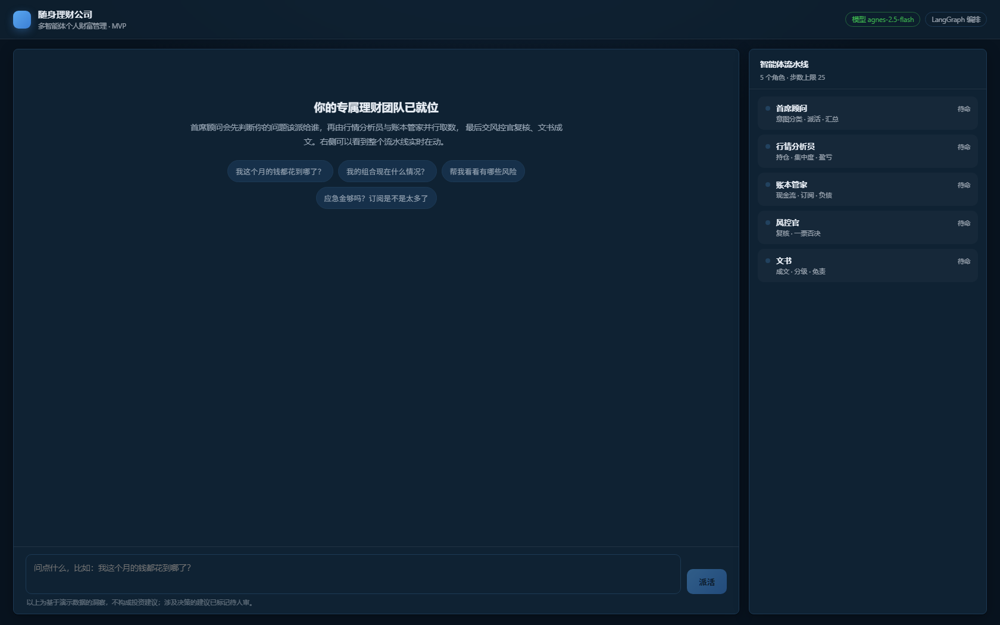
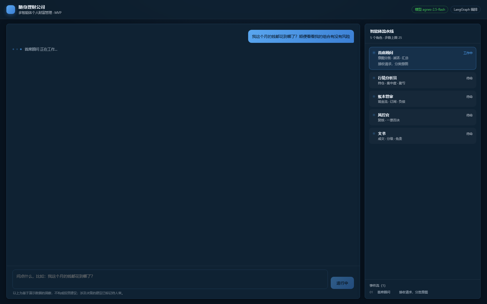
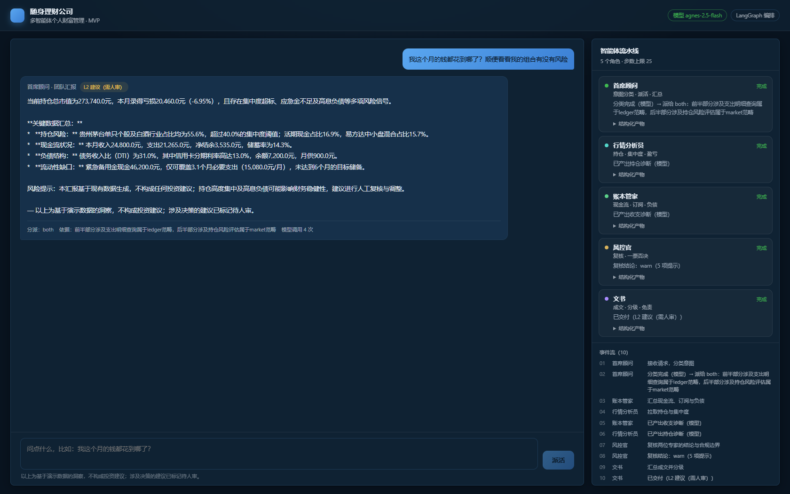
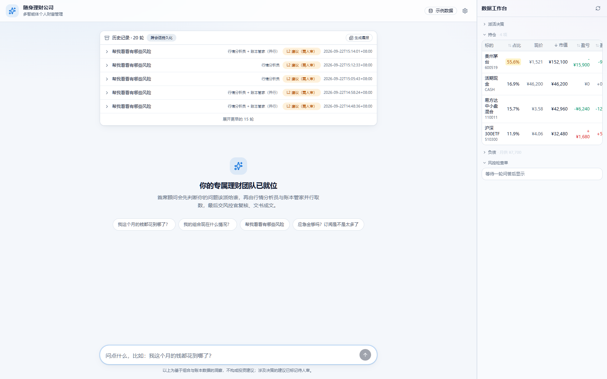
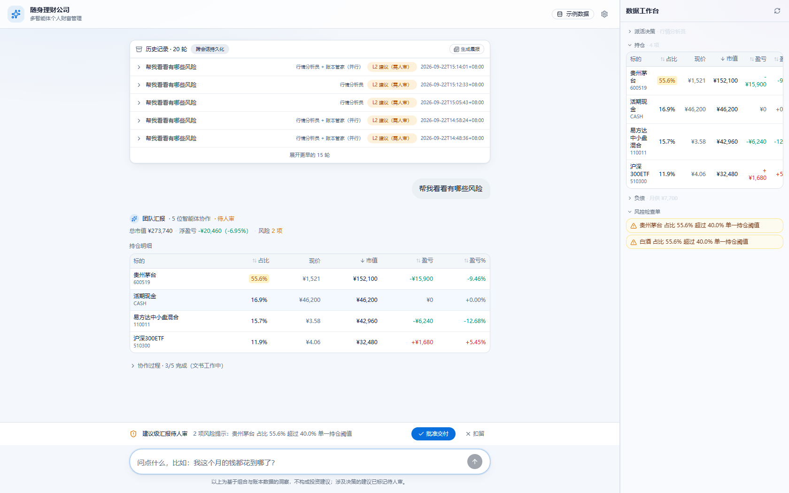
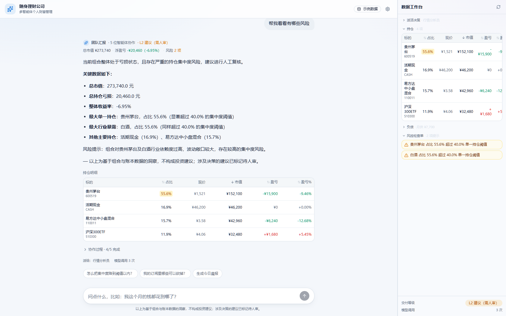
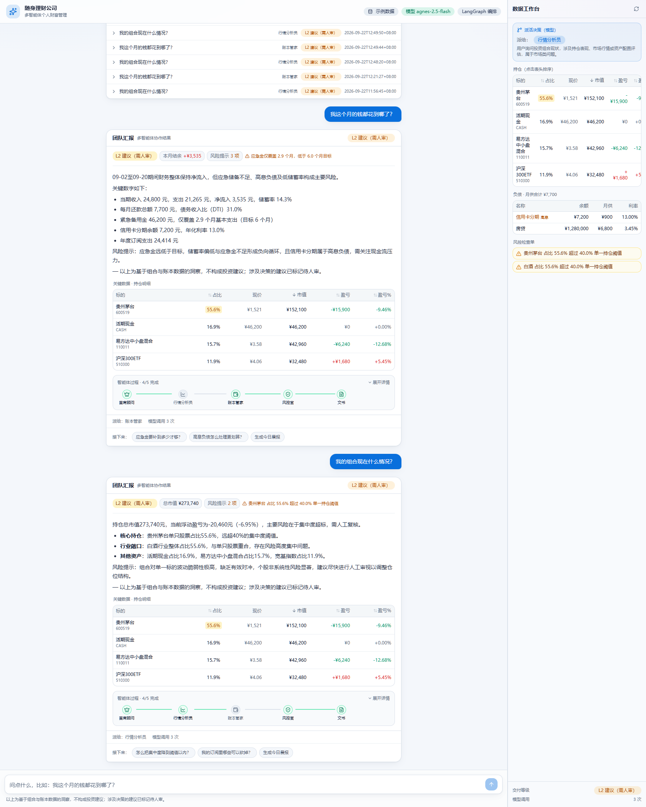
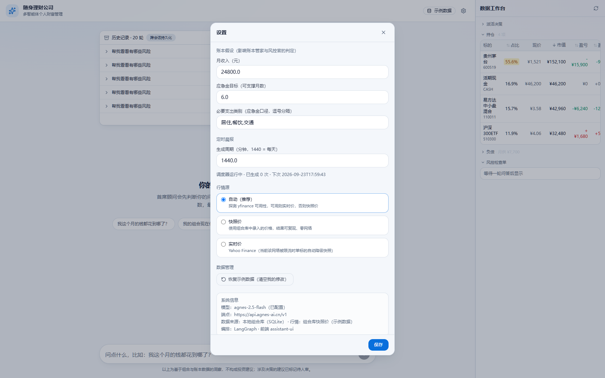

# 随身理财公司 · 多智能体 MVP

给每个用户配一家"随身理财公司"：一支多智能体团队协同处理个人财政与投资问题。
这是**最小可运行版本**，目的是把编排链路跑通、让"多智能体在协作"这件事肉眼可见。

## 界面速览



顶栏精简（品牌 + 数据来源徽章 + 齿轮），左侧对话线程、右侧数据工作台（持仓/负债/风控检查单）。



一轮问答里 4 个智能体（supervisor / market / ledger / risk）协同，过程以可折叠 stepper 呈现，默认收起。



结论摘要（关键数字 chip）+ 可排序持仓表（红涨绿跌）+ 追问 chips。



跨会话历史默认折叠为最近 5 条，可展开 / 生成晨报。



持仓表可排序、数字右对齐、红涨绿跌，与负债表 / 风控检查单各自独立折叠。



L2 建议级在文书成文前走人审闸门（HITL）：粘性操作条"批准 / 扣留"恒在视线内。



风控官（Critic）的确定性规则检查：集中度 / 应急金 / 高息负债 / 储蓄率，有告警则降级为"建议级需人审"。


成文交付的报告产物（事实陈述 + 建议分级标注）。



顶栏齿轮打开的设置面板：账本假设 / 定时晨报 / 行情源三选一 / 数据管理 / 系统信息（只读），保存即写后端、下一轮问答生效。

## 跑起来

```bash
# 后端（已装好依赖）
cd backend
.venv/Scripts/python -m uvicorn app.main:app --host 127.0.0.1 --port 8787

# 前端：开发模式（改代码热更新）
cd frontend
npm run dev            # http://127.0.0.1:5199（/api 反代到 8787）

# 前端：生产模式（构建后由后端单端口托管）
cd frontend && npm run build
# 然后访问 http://127.0.0.1:8787
```

模型配置在 `backend/.env`（任何 OpenAI 兼容端点）。**未配置也能跑** ——
会退回确定性模板，界面会如实标注"模板兜底"，不会假装是模型输出。

## 编排拓扑（LangGraph）

```
START → 首席顾问 supervisor ─┬─→ 行情分析员 market ─┐
                             └─→ 账本管家 ledger  ─┴─→ 风控官 risk → 文书 finalize → END
```

- **Supervisor** 先分类意图（模型优先，失败降级为规则），再派活。
- `both` 时两个专家**并行**（条件边返回列表 = fan-out），风控官等两者都完成才执行。
- **风控官是 Critic**：确定性规则检查（集中度/应急金/高息负债/储蓄率）+ 模型复核，
  有告警则把交付等级标为 `L2 建议（需人审）`。
- **人审闸门（HITL）**：L2 建议级在文书成文前经 LangGraph `interrupt()` 暂停，
  前端出"建议级汇报待确认"卡（列出风控提示与专家结论预览）；**批准**才成文交付，
  **扣留**则内容不发送（只留一条"已扣留"记录）。批准/扣留都经 `/api/resume` 续跑并归档。
  定时任务传 `configurable.hitl=False` 跳过闸门（产物仍是事实陈述，无操作建议）。
- `recursion_limit` 做步数熔断（无限再委派是多智能体第一大事故源）。

## 目录

```
backend/app/
  state.py            图状态（先定 schema，追加型字段用 reducer）
  graph.py            LangGraph 装配（AsyncSqliteSaver 持久化 checkpoint）
  agents.py           五个节点：supervisor / market / ledger / risk / finalize
  llm.py              模型接入 + 失败降级
  db.py               组合库 + 运行历史（SQLite，首次自动种子示例数据）
  tools/data_client.py   DataClient 统一数据出口（来源标注 + TTL 缓存 + 可插拔行情源）
  tools/demo_data.py     取数工具薄壳（签名即契约，M2 可原样搬进 MCP server）
  main.py             FastAPI：SSE 流式 + 组合库/历史 API + 静态托管
frontend/src/
  App.tsx             装配：assistant-ui 运行时 + 双栏布局 + 窄屏抽屉 + 历史加载
  components/ChatThread.tsx    对话线程：结论摘要 → 正文 → 持仓表 → 过程 stepper → 追问 chips
  components/SummaryBlock.tsx  结论摘要（结构化工件的关键数字 chip，不从散文抠数）
  components/PositionsTable.tsx 持仓数据表（可排序、数字右对齐、红涨绿跌）
  components/PipelineStepper.tsx 智能体过程一行 stepper（默认折叠，点节点看详情）
  components/StickyActionBar.tsx HITL 粘性操作条（批准/扣留恒在视线内）
  components/TeamPanel.tsx     数据工作台：持仓表 + 负债表 + 风控检查单（窄屏抽屉复用）
  components/HistorySection.tsx 跨会话历史（后端持久化，刷新/重启后仍在）+ 生成晨报
  lib/wealthAdapter.ts         后端 SSE → ChatModelAdapter 桥
  lib/format.ts                金额/百分比格式化 + 红涨绿跌
  数据契约见 lib/types.ts
data/
  wealth.db       组合/账本/订阅/负债 + runs 运行历史
  checkpoints.db  LangGraph 状态 checkpoint
docs/
  screenshots/    界面截图（README 速览引用）
  
```

## 数据与 API

数据不再硬编码：持仓/账本/订阅/负债存 SQLite（`backend/data/wealth.db`），
首次运行种子为一套示例数据；**改成你自己的真实数据后，所有诊断随之变化**。

| 端点 | 说明 |
|---|---|
| `GET /api/portfolio` | 读组合库（持仓/流水/订阅/负债/设置 + 数据来源标注） |
| `PUT /api/portfolio/positions` | 整体替换持仓（录入你的真实组合） |
| `POST /api/portfolio/transactions` | 记一笔流水 |
| `DELETE /api/portfolio/transactions/{id}` | 删一笔流水 |
| `PUT /api/portfolio/debts` · `POST /api/portfolio/reset` | 改负债 / 恢复示例数据 |
| `GET /api/history?thread_id=&limit=` | 运行历史（跨会话持久化，审计链可回放） |
| `POST /api/ask` | SSE 流式问答（带 `thread_id` 归档本轮） |

行情源可插拔：默认用库内快照价（可复现、零网络）；装了 `yfinance` 且可联网时，
在 `tools/data_client.py` 把 `SnapshotSource` 换成 `YFinanceSource` 即可，取不到自动降级。

## 明确没做的

- **实时行情源**：已留好 `QuoteSource` 插槽与降级路径，接 `yfinance`/`akshare` 是配置不是改造；
  尚未默认启用（避免限流影响演示可复现性）。
- **定时晨报 / HITL 确认流**（M2）：checkpoint 已持久化（SQLite），编排层的 interrupt 与 cron 触发未接。
- **不做自动执行**（L4）：下单/调仓涉牌照与合规，不在路线图内。
